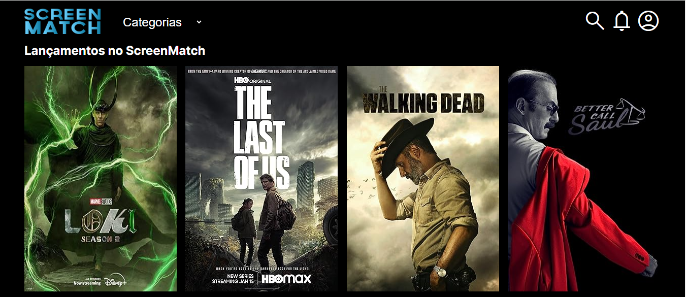
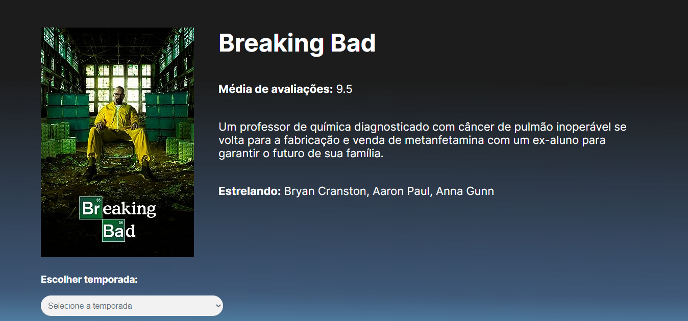

# ScreenMatch 🎬

Projeto desenvolvido por **Yan Victor de Miranda Teodosio** durante a formação **Java Web** da **Alura**, com a proposta de criar uma aplicação web utilizando **Spring Boot**, integrando e consumindo as APIs do **OMDb** e **OpenAI (ChatGPT)** para buscar, traduzir, tratar e persistir dados de séries em um banco de dados relacional, disponibilizando endpoints REST para o front-end.

---

### 📷 Interface da Aplicação

  
    
  

> *Front-End disponibilizado pela instrutora da Alura:* [<kbd>Acessar Layout Front-End</kbd>](https://github.com/alura-cursos/3356-java-web-front)

---

## 🔨 Funcionalidades & Endpoints da API

1. **Obter Todas as Séries**  
   * **Endpoint:** `GET /series` ou `/series/todas`  
   * **Descrição:** Retorna a lista de todas as séries cadastradas no banco de dados.

2. **Obter Top 5 Séries**  
   * **Endpoint:** `GET /series/top5`  
   * **Descrição:** Retorna as 5 séries com as melhores avaliações.

3. **Obter Lançamentos Mais Recentes**  
   * **Endpoint:** `GET /series/lancamentos`  
   * **Descrição:** Retorna os lançamentos mais recentes cadastrados.

4. **Obter Detalhes de uma Série por ID**  
   * **Endpoint:** `GET /series/{id}`  
   * **Descrição:** Retorna os detalhes completos de uma série específica pelo seu identificador.

5. **Obter Todas as Temporadas de uma Série**  
   * **Endpoint:** `GET /series/{id}/temporadas/todas`  
   * **Descrição:** Retorna todos os episódios de todas as temporadas da série informada.

6. **Obter Episódios de uma Temporada Específica**  
   * **Endpoint:** `GET /series/{id}/temporadas/{numero}`  
   * **Descrição:** Retorna a lista de episódios de uma temporada específica.

7. **Obter Séries por Categoria (Gênero)**  
   * **Endpoint:** `GET /series/categoria/{nomeGenero}`  
   * **Descrição:** Filtra e retorna as séries com base na categoria/gênero especificado (ex: Ação, Comédia, Drama).

8. **Obter Top Episódios de uma Série**  
   * **Endpoint:** `GET /series/{id}/temporadas/top`  
   * **Descrição:** Retorna os episódios mais bem avaliados de uma série específica.

---

## 🛠️ Tecnologias e Ferramentas Utilizadas

* **Linguagem:** Java (JDK 17+)
* **Framework:** Spring Boot 3
* **Persistência & Banco de Dados:** Spring Data JPA / PostgreSQL
* **Web:** Spring Web (REST API / CORS)
* **Serialização/Deserialização:** Jackson
* **Ferramenta de Build:** Apache Maven Wrapper

### 🌐 APIs Externas Consumidas
* [OMDb API](https://www.omdbapi.com/) — Obtenção de dados e detalhes de filmes/séries.
* [OpenAI API (ChatGPT)](https://platform.openai.com/) — Tradução e geração de sinopses automatizadas.

---

## 👨‍💻 Desenvolvedor

**Yan Victor de Miranda Teodosio**  
Estudante de Análise e Desenvolvimento de Sistemas e Desenvolvedor Full Stack em formação.

---

## 🤝 Contribuições

Contribuições, correções e sugestões são sempre bem-vindas! Sinta-se à vontade para abrir uma *Issue* ou enviar um *Pull Request*.

⭐️ **Se este projeto te ajudou ou inspirou, deixe uma estrela no repositório!**
